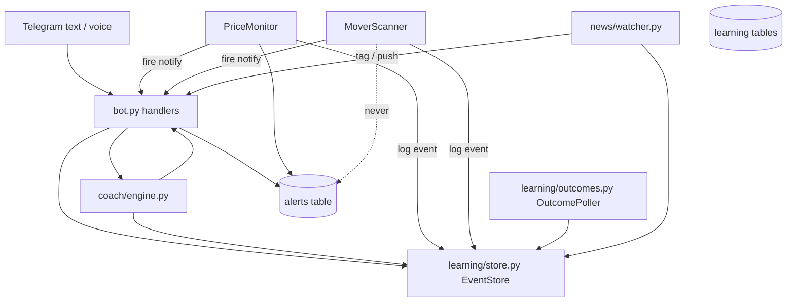
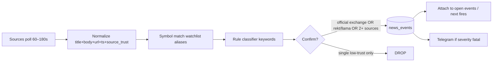

# V4 — Trading Assistant (Learning + Coach)

**Status:** Draft (approved direction 2026-07-28)  
**Owner:** Kenneth Johansson  
**Repo:** `mexc-alert-bot`  
**Related:** [AGENTS.md](../AGENTS.md) · [TRADING_STRATEGY.md](TRADING_STRATEGY.md) · [SESSION_HANDOFF.md](SESSION_HANDOFF.md) · [FUTURE_STRATEGY_BOTS.md](FUTURE_STRATEGY_BOTS.md)

---

## 1. Overview

The bot today is an excellent **sensor layer** (spot/futures one-shot targets + downside movers with cascade, velocity, heat). It does **not** remember what fired, whether Kenneth traded it, or how the bounce played out — so it cannot improve recommendations over time.

**V4** adds a **memory + coach layer** beside existing monitors:

1. **Event log** of every meaningful sensor fire (and later news hits).  
2. **Human labels** + **auto outcome tracking** (price path after fire).  
3. **Fatal-class news** tagging (delist / hack / closure / scam) with hard anti–false-flag rules.  
4. **Coach surface** on Telegram (text first → voice → multi-turn fluent agent).  
5. **V2 shell** later: multi-device UI on the same brain.

**Non-negotiable:** spot target `stable_id` crossing stays untouched; movers never delete `alerts`; new work is feature-flagged default OFF; no auto-trading in V1.

---

## 2. Background & Motivation

| Pain | Today | Desired |
|------|--------|---------|
| Fires are ephemeral | Telegram message only | Structured event rows |
| No feedback loop | Cannot learn setup quality | Labels + bounce/DD outcomes |
| Isolated dumps vs panic | Heat/velocity partial | + fatal news filter |
| Screen time | Commands only | Talk to an agent while trading |
| Multi-device | Telegram only | V2: clean overview UI |

Strategy fit is defined in [TRADING_STRATEGY.md](TRADING_STRATEGY.md): AD mean-reversion, panic > grind, exponential layers, plan → alarm → leave screen.

---

## 3. Goals & Non-Goals

### Goals (V1 product)

- Keep **all** current features working.  
- **Learn** from alarms/trades via event log + labels + outcomes.  
- **Fatal news** only: delisting, project closure, hacks/exploits, confirmed scams.  
- Use existing **kline red counts** when enabled (no rewrite of fire path).  
- Path to **fluent conversational agent** (Telegram-first).  
- Session brief, journal marks, rule-based coach using strategy doc + memory.

### Non-Goals (V1)

- Auto-placing orders on MEXC.  
- Replacing visual AD measurement with a pure % formula.  
- Full multi-device polished UI (that is **V2**).  
- Training a custom ML model day one.  
- Buzz as primary push channel.  
- Pushing on price opinions, analyst FUD, or soft “maybe dump” headlines.

---

## 4. Phased delivery

| Phase | Ship | Flag(s) |
|-------|------|---------|
| **V1.0** | Event log, labels, outcome poller, journal cmds, `/coach` + `/brief` (rule-based) | `FEATURE_LEARNING` |
| **V1.0b UX** | Fire **inline buttons** Took/Skip/Later, `/desk`, plain-language labels — see [ASSISTANT_UX.md](ASSISTANT_UX.md) | `FEATURE_LEARNING` |
| **V1.1** | Fatal news watcher + fire tags + optional push | `FEATURE_NEWS_MONITOR` |
| **V1.2** | Voice notes → STT → same tools | `FEATURE_VOICE` |
| **V1.3** | Optional MEXC **read-only** fills → journal | `FEATURE_MEXC_PRIVATE_READ` |
| **V2** | Web/PWA multi-device desk (same API/brain) | separate deploy |

**End state conversation:** multi-turn agent with session memory, strategy rules, journal stats, and tool calls (prices, alarms, movers, labels). Voice is a **channel** into that agent, not a separate product.

---

## 5. Proposed design

### 5.1 Architecture



**Pattern:** same isolation as movers — new tables in the **same SQLite file**, separate module, own RLock; **never** `DELETE FROM alerts` from learning/news/coach.

### 5.2 Module map

| Path | Role |
|------|------|
| `mexc_bot/learning/store.py` | `EventStore`: events, labels, outcomes, journal |
| `mexc_bot/learning/outcomes.py` | Background poller for bounce/DD after events |
| `mexc_bot/learning/stats.py` | Aggregates for coach (per symbol, velocity band) |
| `mexc_bot/coach/engine.py` | Rule stack + memory → reply text |
| `mexc_bot/coach/tools.py` | Tool surface for agent (price, alert, mw, journal) |
| `mexc_bot/news/watcher.py` | Poll sources, classify, store, notify |
| `mexc_bot/news/classify.py` | Fatal-class rules + corroboration |
| `mexc_bot/news/sources/*.py` | Per-source adapters |

Wire in `main.py` only when flags on. Pass `event_store` into scanner/monitor fire paths and `create_bot`.

### 5.3 Learning model (V1.0)

#### Tier A — Event log (automatic)

On every:

- Mover peak fire  
- Mover step fire  
- Heat auto board (optional single “heat” event or skip to reduce noise)  
- Target alert fire (optional; useful for planned levels)

Write one row with: `user_id`, `source`, `symbol`, `market`, `ts`, prices, `drop_pct`, `velocity_band`, `heat_breadth`, `mode` (peak|step), optional `news_severity` later.

#### Tier B — Human labels (required for real learning)

Telegram after fire or anytime:

| Command / mark | Meaning |
|----------------|---------|
| `/j took [symbol]` | Took the setup |
| `/j skip [symbol]` | Skipped |
| `/j pride` | Pride-hold risk flag on last/open trade |
| `/j bounce strong\|weak\|none\|failed` | Bounce quality |
| `/j note …` | Free text |
| Inline buttons (later) | Same as `/j` with 1 tap |

Label attaches to **latest unlabeled event** for that user+symbol (or explicit event id).

#### Tier C — Outcomes (automatic)

`OutcomePoller` thread (or piggyback mover poll with longer cadence):

- Horizons: **+15m, +1h, +4h** from event time (configurable).  
- Record: `max_bounce_pct` from fire price, `max_dd_pct`, `last_price`.  
- Soft-fail if price missing.

#### Tier D — Journal trades (manual; keys later)

```
/trade open f TSLA 250 note first layer
/trade layer 248 size 2x
/trade close 255 reason bounce
/trade list
```

Optional V1.3: MEXC read-only API reconciles fills into journal rows.

### 5.4 Coach (V1.0 → fluent agent)

**V1.0 — rule-based + memory**

- `/brief` — heat summary, open journal, last N events, top panic-quality names (velocity + breadth).  
- `/coach <question>` — walk TRADING_STRATEGY rules 1–8 when advising; cite memory stats if any.  
- No LLM required for V1.0 if we ship templates; optional LLM later for prose.

**V1.2+ — fluent agent**

```
user message / voice
  → STT if voice
  → LLM with tool schemas + system prompt = TRADING_STRATEGY + recent events
  → tool calls only for facts (price, add alert, mw, journal, stats)
  → multi-turn session state per user_id (in-memory + optional DB)
```

**Rules for agent speech** (from strategy §7.4): label PANIC vs GRIND vs ISOLATED; concrete layers when high conviction; **no-trade** cleanly; never invent fills.

### 5.5 Kline reds

Already implemented behind `MOVER_ENRICH_KLINES` (default false). V1:

- Log `reds_5m` / etc. onto event payload when enrichment is on.  
- Coach may mention red streak as secondary grind signal.  
- No change to fire logic.

---

## 6. News monitor — anti false-flag plan

### 6.1 In-scope severity only

| Class | Examples | Action |
|-------|----------|--------|
| `DELIST` | MEXC/CEX delisting announcement | Push + tag events |
| `CLOSURE` | Project wind-down, token sunset | Push + tag |
| `HACK` | Confirmed exploit, drained protocol | Push + tag |
| `SCAM` | Confirmed rug / exit scam (not rumor) | Push + tag |

**Never push alone for:** price takes, “could crash”, partnerships, unlock calendars, macro Fed, vague FUD, single unverified tweet.

### 6.2 Efficient sources (priority order)

| Priority | Source | Why | False-flag risk | V1.1 role |
|----------|--------|-----|-----------------|-----------|
| **P0** | **MEXC announcements** (official blog / announcement center / RSS if available) | Ground truth for **delistings** on the venue Kenneth trades | Very low | **Primary DELIST** |
| **P0** | **Rekt.news** (RSS/API) | High-signal exploit ledger | Low | **Primary HACK** |
| **P0** | **DefiLlama hacks** endpoint (if stable) | Structured exploit amounts | Low | Primary/secondary HACK |
| **P1** | **CryptoPanic API** with `filter=important` + currency codes = **watchlist only** | Aggregation; must not use unfiltered feed | **High** without filters | Secondary corroboration + keyword gate |
| **P1** | **Binance/OKX/Bybit delist notices** (optional RSS) | Cross-exchange delist often predicts MEXC | Low–med | DELIST corroboration |
| **P2** | **Messari** news/events API | Curated events (exploits, migrations) | Low | Optional paid upgrade |
| **P2** | X accounts: `@PeckShieldAlert`, `@CertiKAlert`, `@SlowMist_Team` | Fast hacks | Medium (retweets/noise) | Secondary only **after** keyword + no free-text “rumor” |
| **Avoid as primary** | General crypto Twitter, Telegram alpha groups, Reddit | Extreme noise | Critical | Out of scope |

**Efficiency rule:** poll **only symbols on** mover watchlist ∪ open journal ∪ active target symbols for that user (plus global DELIST feed from MEXC which is short). Do not ingest full-market rumor firehose.

### 6.3 Classification pipeline



**Confirm threshold (must pass one):**

1. **Official exchange** announcement (MEXC/major CEX) → trust `official`, class DELIST/CLOSURE.  
2. **High-trust security ledger** (Rekt, DefiLlama hacks, PeckShield *confirmed* style) → HACK.  
3. **Corroboration:** ≥2 independent sources within 2h matching same symbol + class.  
4. Else: store as `unconfirmed` **without push** (optional debug log only).

**Keyword allowlist (examples, multi-language later):**  
`delist`, `delisting`, `will remove`, `suspend trading`, `hack`, `exploit`, `drained`, `rug`, `exit scam`, `insolvent`, `wind down`, `shutting down`, `cease operations`.

**Denylist (reject push):**  
`could`, `might`, `analyst`, `price prediction`, `bullish`, `bearish outlook`, pure technical analysis, “community FUD”.

**Optional LLM:** only as second-pass *on candidates that already passed keyword gate* — classify class + confidence; never sole gate for push in V1.1.

### 6.4 Telegram UX for news

```
⚠️ FATAL NEWS · DELIST
SIREN (spot) · source: MEXC Announcements
"..."
→ Strategy: treat as isolated/destructive risk (Rule 6). Prefer no-trade / micro only.
```

On mover fire for same symbol within lookback: append  
`NEWS: DELIST (MEXC, 12m ago)` so Kenneth knows the dump is not clean panic liquidity.

### 6.5 Soft-fail

News API down → log warning, **movers and targets continue**. Never block fires on news.

---

## 7. Data model (additive SQLite)

Same DB file as `alerts` / mover tables. New tables only.

```sql
-- sensor + news-linked events
CREATE TABLE IF NOT EXISTS learning_events (
  id INTEGER PRIMARY KEY AUTOINCREMENT,
  user_id INTEGER NOT NULL,
  source TEXT NOT NULL,          -- mover_peak | mover_step | heat | target | news | manual
  symbol TEXT NOT NULL,
  market TEXT NOT NULL,          -- spot | futures
  ts REAL NOT NULL,              -- unix
  price REAL,
  ref_price REAL,                -- high or anchor
  drop_pct REAL,
  velocity_band TEXT,            -- PANIC | FAST | GRIND | null
  heat_breadth INTEGER,
  mode TEXT,                     -- peak | step | null
  payload_json TEXT,             -- extras: reds, volume, msg snippet
  news_event_id INTEGER          -- FK optional
);

CREATE TABLE IF NOT EXISTS learning_labels (
  id INTEGER PRIMARY KEY AUTOINCREMENT,
  event_id INTEGER NOT NULL,
  user_id INTEGER NOT NULL,
  action TEXT,                   -- took | skip | watch | null
  bounce_quality TEXT,           -- strong | weak | none | failed
  behavior TEXT,                 -- pride | greed | plan_ok | false_panic | null
  notes TEXT,
  ts REAL NOT NULL,
  FOREIGN KEY (event_id) REFERENCES learning_events(id)
);

CREATE TABLE IF NOT EXISTS learning_outcomes (
  event_id INTEGER NOT NULL,
  horizon_seconds INTEGER NOT NULL,
  max_bounce_pct REAL,
  max_dd_pct REAL,
  last_price REAL,
  computed_at REAL NOT NULL,
  PRIMARY KEY (event_id, horizon_seconds)
);

CREATE TABLE IF NOT EXISTS journal_trades (
  id INTEGER PRIMARY KEY AUTOINCREMENT,
  user_id INTEGER NOT NULL,
  symbol TEXT NOT NULL,
  market TEXT NOT NULL,
  status TEXT NOT NULL,          -- open | closed
  entry_avg REAL,
  exit_avg REAL,
  notes TEXT,
  opened_at REAL,
  closed_at REAL
);

CREATE TABLE IF NOT EXISTS news_events (
  id INTEGER PRIMARY KEY AUTOINCREMENT,
  symbol TEXT,                   -- base or null if exchange-wide
  class TEXT NOT NULL,           -- DELIST | CLOSURE | HACK | SCAM
  severity TEXT NOT NULL,        -- fatal | unconfirmed
  title TEXT NOT NULL,
  url TEXT,
  source TEXT NOT NULL,
  source_trust TEXT NOT NULL,    -- official | rekt | llama | aggregate | social
  ts REAL NOT NULL,
  raw_json TEXT
);
```

Migration: `CREATE TABLE IF NOT EXISTS` only. **No** `DROP`/`ALTER` of `alerts`.

### EventStore interface (sketch)

```python
class EventStore:
    def log_event(...) -> int: ...
    def label_event(event_id, user_id, **fields) -> None: ...
    def label_latest(user_id, symbol=None, **fields) -> Optional[int]: ...
    def record_outcome(event_id, horizon_seconds, ...) -> None: ...
    def recent_events(user_id, limit=20) -> list[dict]: ...
    def stats_for_symbol(user_id, symbol, market) -> dict: ...
```

---

## 8. API / Telegram surface (V1.0)

| Command | Flag | Behavior |
|---------|------|----------|
| `/j took [sym]` `/j skip` `/j bounce …` `/j pride` `/j note …` | LEARNING | Labels |
| `/trade open\|layer\|close\|list` | LEARNING | Manual journal |
| `/brief` | LEARNING | Session snapshot |
| `/coach [text]` | LEARNING | Rule-based advice |
| `/events [n]` | LEARNING | Last n logged fires |
| Existing `/a` `/af` `/mw` `/movers` `/p` `/l` … | unchanged | Sensors |

Voice (V1.2): Telegram voice message → STT → parse intent → same handlers.

---

## 9. Config flags (defaults OFF in `.env.example`)

```bash
FEATURE_LEARNING=false
FEATURE_NEWS_MONITOR=false
FEATURE_VOICE=false
FEATURE_MEXC_PRIVATE_READ=false

LEARNING_OUTCOME_HORIZONS_SECONDS=900,3600,14400
LEARNING_OUTCOME_POLL_SECONDS=60

NEWS_POLL_SECONDS=90
NEWS_CRYPTOPANIC_TOKEN=          # optional
NEWS_PUSH_UNCONFIRMED=false      # always false recommended

VOICE_STT_PROVIDER=openai        # or local; key on droplet only
```

---

## 10. Security & privacy

| Risk | Mitigation |
|------|------------|
| Bot token / news API keys | Droplet `.env` only; never commit |
| MEXC private keys (V1.3) | **Read-only** sub-account keys; separate flag; document rotation |
| LLM tools inventing trades | Tools only mutate via existing store methods; coach cannot place orders |
| News spam | Fatal-class + confirm threshold + per-symbol rate limit (e.g. 1 push / 30m / class) |
| Prompt injection via news titles | Don’t execute titles as commands; store as data |

---

## 11. Observability

- Log: `learning.event logged id=…`, `learning.label`, `learning.outcome horizon=…`, `news.drop unconfirmed`, `news.push`.  
- `/s` status: learning on/off, events_24h, pending outcomes, news last poll OK.  
- Failures: soft-fail, increment counters, no crash of monitor threads.

---

## 12. Rollout

1. Ship V1.0 code, flags **false** in example; enable on **staging** first.  
2. Smoke: fire a mover (or synthetic test) → `/events` shows row → `/j took` → wait outcome horizons in unit tests with frozen time.  
3. Prod: `FEATURE_LEARNING=true` only after `/l` targets intact.  
4. V1.1 news on staging with real MEXC delist RSS dry-run.  
5. Kill switch: set flags false, rebuild.

---

## 13. Alternatives considered

| Alternative | Pros | Cons | Decision |
|-------------|------|------|----------|
| External DB / service for learning | Cleaner separation | Ops burden, two stores | **Reject for V1** — same SQLite |
| Auto-learn without labels | Less work | Cannot capture pride/skip/AD intent | **Reject** as sole approach |
| Full LLM coach before event log | Fancy chat | No memory, hallucinated advice | **Reject order** — log first |
| Unfiltered CryptoPanic / Twitter | Fast | Massive false flags | **Reject** as primary |
| Separate “news bot” process | Isolation | Deploy complexity | **Reject V1** — thread in same process |

---

## 14. Risks

| Risk | Sev | Mitigation |
|------|-----|------------|
| Touching alert fire path breaks prod | Critical | Only add optional `event_store.log` after notify; tests for crossing unchanged |
| Outcome poller API load | Medium | Batch symbols; 60s poll; only pending horizons |
| News false positives hurt trust | High | Official/rekt primary; confirm rules; default unconfirmed silent |
| Coach overconfidence | Medium | Always cite rules; no-trade decisive; “not financial advice” |

---

## 15. Open questions (defaults if no answer)

1. **LLM in V1.0 coach?** Default: **no** — templates + rules; LLM in V1.2 with tools.  
2. **Log target-alert fires?** Default: **yes** (source=`target`).  
3. **Heat boards as events?** Default: **no** (noise); only peak/step + target + news.  
4. **CryptoPanic free tier enough?** Start without it if key missing; MEXC + Rekt first.

---

## 16. Key decisions

1. **Learning is hybrid** — sensors + labels + outcomes; optional private fills later.  
2. **Same SQLite, new tables** — mover isolation pattern.  
3. **News is fatal-class only** with official/rekt-first confirm pipeline.  
4. **Coach starts rule-based**; fluent multi-turn agent is the end state; voice is a channel.  
5. **No auto-trade V1.**  
6. **Flags default OFF**; enable per environment.  
7. **Telegram remains panic push**; V2 is multi-device UI on same brain.

---

## 17. PR plan

### PR1 — Learning foundation (V1.0 core)
- **Files:** `mexc_bot/learning/*`, `config.py`, `.env.example`, `main.py`, `bot.py` (journal/events/j), wire log hooks in `movers/scanner.py` (+ optional monitor), tests  
- **Deps:** none  
- **Ship:** EventStore, log on mover fire, `/events`, `/j`, outcome poller, `/s` learning line  

### PR2 — Coach brief (V1.0 coach)
- **Files:** `mexc_bot/coach/*`, `bot.py` `/brief` `/coach`, tests  
- **Deps:** PR1  
- **Ship:** Rule-based brief + coach using stats + strategy checklist  

### PR3 — Fatal news (V1.1)
- **Files:** `mexc_bot/news/*`, config, bot tag on fires, tests with fixtures  
- **Deps:** PR1  
- **Ship:** MEXC + Rekt adapters, classifier, push, event tag  

### PR4 — Voice channel (V1.2)
- **Files:** voice handler, STT client, map to tools  
- **Deps:** PR1–2  
- **Ship:** Voice → commands/coach  

### PR5 — Optional private fills (V1.3)
- **Files:** `exchange_private.py`, journal reconcile  
- **Deps:** PR1  
- **Ship:** Read-only MEXC sync behind flag  

### PR6 — V2 UI (later)
- **Files:** new web app / API  
- **Deps:** PR1–3 stable  
- **Ship:** Cross-device overview + chat  

---

## 18. Implementation notes for agents

- Prefer `/mw add` patterns for watchlist; learning must not wipe watchlists.  
- Fire notifications stay HTML; commands plain text.  
- Tests: keep `test_crossing_and_remove_logic.py` green always.  
- Update [SESSION_HANDOFF.md](SESSION_HANDOFF.md) when a phase ships.

---

## 19. References

- [TRADING_STRATEGY.md](TRADING_STRATEGY.md) — AD rules, psychology, bot mapping  
- [AGENTS.md](../AGENTS.md) — safety, module map  
- [FUTURE_STRATEGY_BOTS.md](FUTURE_STRATEGY_BOTS.md) — news-impact / journal / position guardian backlog  
- Messari News API (optional curated)  
- CryptoPanic developer API (filtered secondary)  
- Rekt.news leaderboard/RSS (hack signal)

<!-- agents: search V4_TRADING_ASSISTANT or learning EventStore -->
